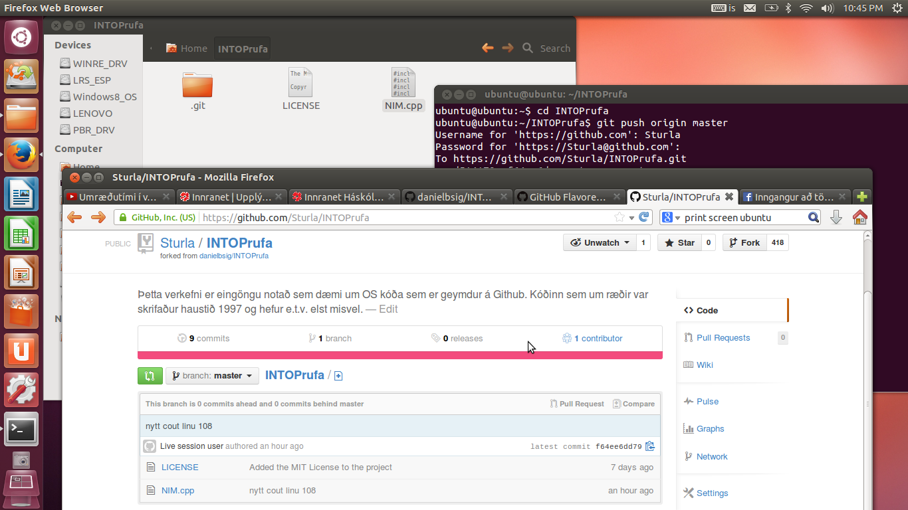

#Open Source

Sturla Halldórsson

## 1. Linux uppsetning

Þetta reyndist eiginlega auðveldasti hluti verkefnisins! Ubuntu 12.04 keyrt upp af USB og nettengdist strax án vandamála.

## 2. Uppsetning á vim && git

Skipanirnar sem fylgdu verkefninu leystu þetta vandræðalaust.

## 3. Unnið með Git (1. hluti)

Lenti í vandræðum þarna með SSH lykilinn og þurfti að gera það allt upp á nýtt. Áttaði mig ekki strax á því að þetta var ekki eins og átti að vera og eyddi
miklum tíma í að átta mig á hvernig þetta Git dót eiginlega virkaði, þegar ég var í raun ekki búin að ganga frá tengingu!

## 4. Uppsettur hugbúnaður

Hér á að koma listi yfir opinn hugbúnað sem þið eruð með á vélunum nú þegar (sjá verkefnislýsingu).

## 5. Unnið með Git (2. hluti)

Hér þarf ekkert að gera annað en að setja niðurstöður úr 4. fyrstu liðunum inn í þetta skjal.
